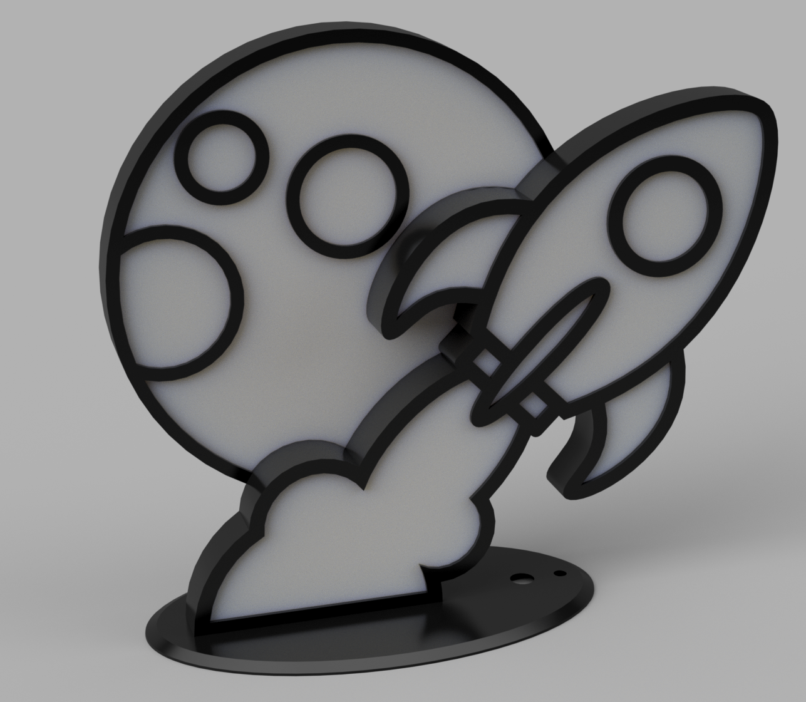
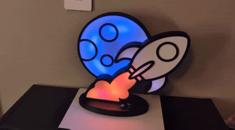
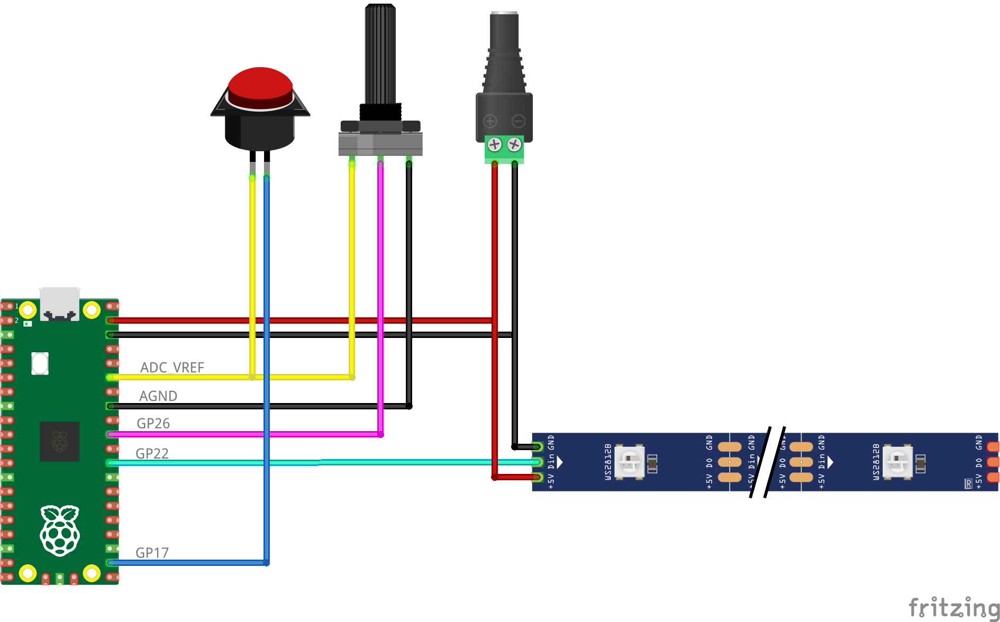

# rocket lamp

# Assemble

## Parts

* PLA Filament (Black + White) < 250g of both required.
* Hot Glue
* Hookup wire (26 AWG)
* Raspberry Pi Pico
* WS2812B RGB LED strip (51 LEDs by default)
* Three Terminal B10K Potentiometer
  * Lamp base modeled for 7mm diameter profile 
* SPST Momentary Push Button
  * Lamp base designed for 13 mm diameter profile
* 2 - M3x8mm countersunk screws (lamp base fasteners)
* 2 - M3 heat set threaded inserts
* 4 - M2x6mm socketheaded screws (pi pico fasteners)
* AC to 5V DC Adapter
  * alternatively, power directly from USB

## Steps

* Print each [STL](/model/stl) file. Use white or translucent filament for cover files. Print 4 instances of peg files.
  * printable build area of at least 280mm required
* I would recommend wiring up / mounting the moon and rocket LED strips and enclosing them in the lamp body before before assembling the base.
  * Glue LEDs across the inner back of the container, 
  * Hot glue the white cover to the inside of the outer cover outline first
  * Hot glue Pegs to inside of container, thinly hot glue cover outline to container
  * Connect moon to rocket container, connect rocket to base top
* Follow the [wire diagram](wire/rocket-lamp_bb.png) below for wiring up the base
* Image Pi Pico with lamp hex file. Either:
  * grab latest version from project releases
  * compile from source using steps below. CMAKE file definitions enable alternate LED counts, PIN selections, etc...
  
# Compile From Source

Built on MacOS using the PICO SDK (modified from pico-examples pio/ws2812)

* [PICO SDK](https://github.com/raspberrypi/pico-sdk) Notes 
  * See: https://datasheets.raspberrypi.com/pico/getting-started-with-pico.pdf
  * For Step `9.1.1. Installing the Toolchain`, install `gcc-arm-embedded` instead of `arm-none-eabi-gcc`
* Run `sh ./configure` for initial cmake configure
* Reconnect pico as needed holding bootselector button
* Run `sh ./deploy.sh` to build and copy to pico

# Wire Diagram

